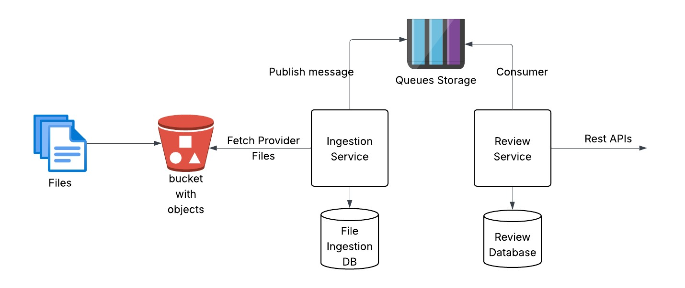

📦 Hotel Review Microservice
A PHP-based microservice that ingests hotel reviews (in .jsonl format) from an AWS S3 bucket, parses them, and stores them in a MySQL database.

🚀 Features:

    1. Connects to AWS S3 and fetches daily review files
    2. Parses JSON Lines data with validation
    3. Idempotent processing
    4. Stores structured reviews in MySQL via Eloquent ORM
    5. CLI-based ingestion command: php index.php ingest
    6. Dockerized for easy deployment
    7. Modular code with clear structure

🛠️ Setup:

1. Clone the Repo
   git clone https://github.com/AbhayKJ/hotel-review-microservice.git
   cd hotel-review-microservice

2. Configure Environment
   Create your .env from the example:
   cp .env.example .env
   Update it with your AWS credentials and DB settings.

3. Start the Services
   docker-compose up --build
    This starts:
        1. PHP CLI app
        2. MySQL server

4. Install PHP Dependencies
   Inside the container:
   docker exec -it php-review-app composer install

🧪 Running the Ingestion

   docker exec -it php-review-app php index.php ingest
    This command:
        1. Lists S3 files
        2. Validates & parses JSONL data
        3. Stores valid entries in MySQL

🧰 Tech Stack

    1. PHP 8.2 (CLI)
    2. AWS SDK for PHP
    3. Eloquent ORM
    4. MySQL 8
    5. Docker + Docker Compose

🧾 MySQL Schema

CREATE TABLE reviews (
    id INT AUTO_INCREMENT PRIMARY KEY,
    hotel_id INT NOT NULL,
    platform VARCHAR(50) NOT NULL,
    hotel_name VARCHAR(255),
    rating DECIMAL(3,1),
    review_text TEXT,
    review_date DATETIME,
    country VARCHAR(100),
    language VARCHAR(10),
    provider_id INT,
    extended_ratings JSON,
    UNIQUE KEY unique_review (hotel_id, review_date)
) CHARACTER SET utf8mb4 COLLATE utf8mb4_unicode_ci;

🧼 Code Structure

    src/
    ├── Models/        # Eloquent ORM Models
    ├── Services/      # AWS S3 File Service
    ├── Helpers/       # JSONL Parser + Validator
    ├── bootstrap.php  # DB + dotenv setup
    index.php          # CLI entry point

📁 Project Structure:

    hotel-review-microservice/ 
    ├── Dockerfile
    ├── docker-compose.yml
    ├── .env.example
    ├── README.md
    ├── index.php
    ├── composer.json
    ├── composer.lock (after install)
    ├── phpunit.xml        ← PHPUnit config
    ├── src/
    │   ├── bootstrap.php
    │   ├── Models/
    │   │   └── Review.php
    │   ├── Services/
    │   │   └── S3Service.php
    │   ├── Helpers/
    │   │   └── JSONLParser.php
    │   └── Repositories/
    │       └── ReviewRepository.php
    ├── tests/              ← ✅ Tests go here
    │   └── ParserTest.php  ← Example test
    └── logs/
        └── app.log

▶️ To Run Tests as below:

    Once inside your container:
    composer require --dev phpunit/phpunit
    ./vendor/bin/phpunit

💡 Architecture Diagram

🧠 High-Level Responsibilities

+------------------+
| index.php        | ← Entry point for CLI: `php index.php ingest`
+--------+---------+
         |
         v
+--------+---------+
| S3Service         | ← Connects to AWS, lists .jl files, downloads line-by-line
| (src/Services)    |
+--------+---------+
         |
         v
+--------+---------+      +----------------------+
| JSONLParser       | --> | Validation / Parsing | ← Cleans each JSON line
| (src/Helpers)     |      +----------------------+
+--------+---------+
         |
         v
+--------+---------+
| ReviewRepository  | ← Handles DB interaction, ensures idempotency, handles errors
| (src/Repositories)|
+--------+---------+
         |
         v
+--------+---------+
| Eloquent Model    | ← Maps to `reviews` table in MySQL
| (src/Models)      |
+------------------+

🔁 Processing Flow

index.php
   └── calls S3Service::processReviews()
         ├── connects to S3
         ├── fetches files (pagination supported)
         ├── for each .jl line:
         │     └── JSONLParser::parse() → validates & transforms
         │           └── ReviewRepository::saveReview()
         │                 └── Review::create() via Eloquent ORM
         │
         └── Logs all events + errors (to file and console)

🧪 Tests & Logging

File	                   Purpose
tests/ParserTest.php	  Unit tests for JSONLParser
logs/app.log	          File output for all logs/errors
phpunit.xml	              Config for running tests

